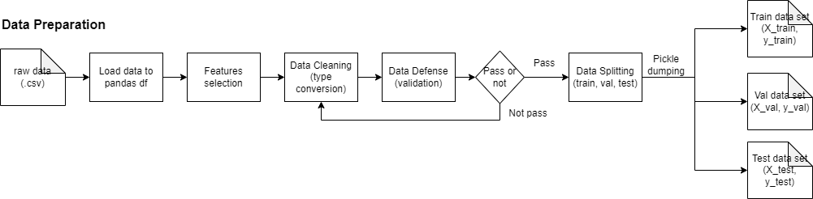

# Gas Detection and Classification

This repository contains information about Gas Detection Classification with Traditional Classification Machine Learning Techniques.

Relying on a single sensor for gas detection may not yield accurate results, as various real-world applications demand robust and reliable detection methods. Implementing a modern ML techniques also requires a lot computational resource, meaning not efficient for an emergency system. Thus, there is a need for developing efficient gas detection systems that utilize simple traditional classification machine learning techniques to enhance the accuracy and reliability of gas detection.

## Dataset Information

- Source paper: "MultimodalGasData: Multimodal Dataset for Gas Detection and Classification" 
- DOI: 10.17632/zkwgkjkjn9.2
- Dataset downloaded from: https://data.mendeley.com/datasets/zkwgkjkjn9/2 (accessed on 12/03/23)

## Instrument Used

The dataset was generated using the following instruments:

1. Metal Oxide Semiconductor (MQ) sensors (consisting of 7 sensors, with each one sensitive to certain gases)
2. Seek Compact Thermal Imaging Camera (UW-AAA)

## Model Stages

The dataset can be used for the following stages of machine learning:

1. Basic ML - Only using numerical data to classify the current environmental condition (Decision Tree, kNN) -> this is what we are planning to do for the moment.
2. Intermediate ML - Using OpenCV to add thermal camera images as a model feature (increasing accuracy on low concentration gas)
3. Adv ML - Implementing deep learning to create a self-learning model

## Gas Sensors and Sensitive Gases

The following table lists the gas sensors used in the dataset and their corresponding sensitive gases:

| Sensor | Sensitive Gas               |
|--------|-----------------------------|
| MQ2    | LPG, Butane, Methane, Smoke |
| MQ3    | Smoke, Ethanol, Alcohol     |
| MQ5    | LPG, Natural Gas            |
| MQ6    | LPG, Butane                 |
| MQ7    | Carbon Monoxide             |
| MQ8    | Hydrogen                    |
| MQ135  | Air Quality (Smoke, Benzene)|

## Steps Block Diagram
This block diagram outlines the steps involved in our process, which include:
### Data Preparation

### Data Pre-processing

### Model Training

### Model Evaluation


## Report Analysis
For a detailed analysis of our research report, please refer to the PDF file [Report Analysis.pdf](/Report-Analysis.pdf). This report provides an in-depth discussion of our data analysis, model evaluation, and conclusions. We encourage you to read this report to gain a better understanding of our methodology and results.

## Predict Gas Type API (FastAPI)

### Endpoint

`POST` `/predict_gas`

### Description

This API endpoint accepts sensor values as input and returns the predicted gas type and its probability for both Random Forest and k-Nearest Neighbors models.

### Request

#### Body

| Parameter | Type | Description                           |
|-----------|------|---------------------------------------|
| MQ2       | int  | Sensor value for MQ2                  |
| MQ3       | int  | Sensor value for MQ3                  |
| MQ5       | int  | Sensor value for MQ5                  |
| MQ6       | int  | Sensor value for MQ6                  |
| MQ7       | int  | Sensor value for MQ7                  |
| MQ8       | int  | Sensor value for MQ8                  |
| MQ135     | int  | Sensor value for MQ135                |

#### Example

```json
{
  "MQ2": 2202,
  "MQ3": 799,
  "MQ5": 529,
  "MQ6": 515,
  "MQ7": 507,
  "MQ8": 696,
  "MQ135": 768
}
```

### Response

#### Body
| Parameter        | Type    | Description                                               |
|------------------|---------|-----------------------------------------------------------|
| knn_prediction   | int     | Predicted gas type using k-Nearest Neighbors model        |
| knn_probability  | float   | Probability of the predicted gas type (k-Nearest Neighbors)|

#### Example

```json
{
  "knn_prediction": 'Perfume',
  "knn_probability": 0.83
}
```

## Deploy Model Locally
### Prerequisites
- Make sure Python and Pip installed in your system (this project use Python 3.10.9 and Pip 23.0.1)
- Install the required packages from requirements.txt (you may use virtual environment for this)
```bash
pip install -r requirements.txt
```

### Running FastAPI app locally
1. Open a terminal or command prompt
2. Navigate to the API project folder
```bash
cd Gas-Detection-Using-Traditional-ML/src/api
```
3. Start the FastAPI app by running the following command:
```bash
uvicorn api:app --reload
```
This will start the FastAPI server on [http://localhost:8000](http://localhost:8000).

### Running Streamlit app locally
1. Open a new terminal or command prompt
2. Navigate to the Streamlit project folder
```bash
cd Gas-Detection-Using-Traditional-ML/src/streamlit
```
3. Start the Streamlit app by running the following command:
```bash
streamlit run src/streamlit/streamlit.py
```
This will start Streamlit app and open it in your default web browser. By default, Streamlit run on [http://localhost:8051](http://localhost:8051)

Now, both FastAPI and Streamlit apps are running locally, and you can interact with the Streamlit app to test and make prediction using the FastAPI and our trained model.

## Retraining Model
You can re-train the model by executing these python source code sequentially:
```bash
python src/data/preparation.py
python src/features/preprocessing.py
python src/models/model_training.py
```
These scripts will re-load the source dataset, pre-processed it and re-train models based on the newly loaded dataset. 
NB: You can check the hyperparameter tuning and model training logs at `logs` folder.

### Docker Build and Run
Or if you want to use Docker engine, you can simply build a Docker image of this project and get it run with the following commands:
```bash
# make sure you are currently on the project folder
docker build -t awdawd gas-type-ML .
docker run -p 8000:8000 -p 8501:8501 gas-type-ML 
```
PS: tested on WSL2

## Deployment Report
If you want to read my report about this ML model solution deployment process on FastAPI and Streamlit, you can [this Medium's article](https://medium.com/@haranobuhardo/traditional-ml-implementation-for-gas-detection-classification-200de8e32bf7)